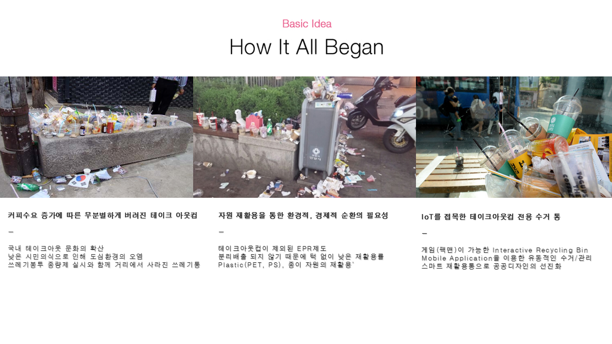
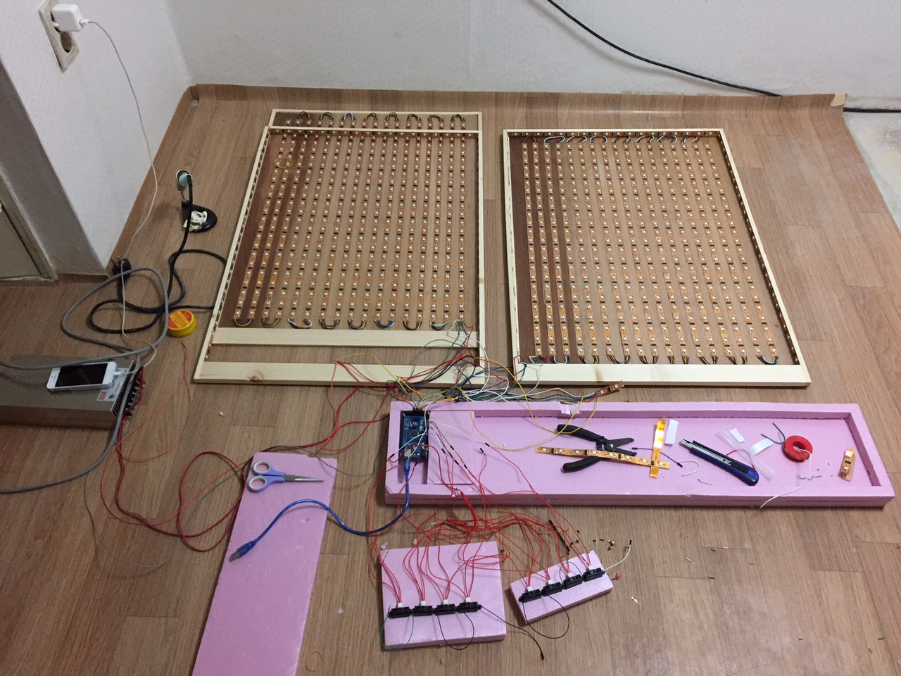
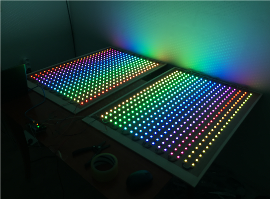
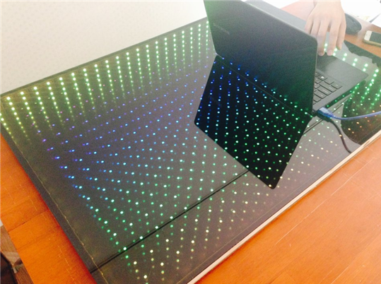
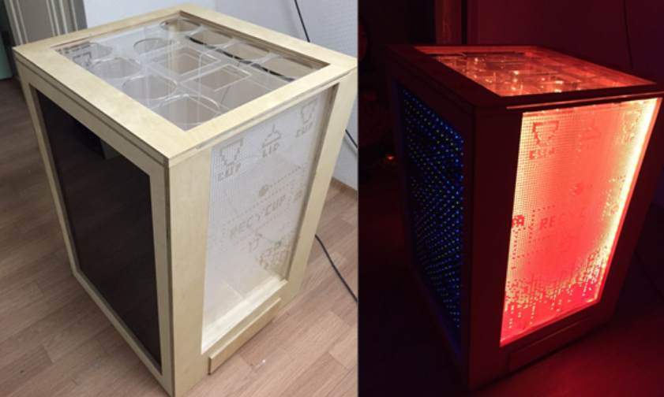

# RecycupProject

### 제작재료 :

- `Arduino Mega 2560 R3 보드` - http://item2.gmarket.co.kr/Item/detailview/Item.aspx?goodscode=640586470&GoodsSale=Y&jaehuid=200001169&NaPm=ct%3Dibufxp08%7Cci%3D72128130dfdf528cf7801022d86079490d3b2753%7Ctr%3Dsl%7Csn%3D24%7Chk%3Db0a5626fc5f0390435c927ee7414dc2fb6dedfd5

- `파워서플라이(SMPS SE-600-5)` - http://www.interpark.com/product/MallDisplay.do?_method=detail&sc.shopNo=0000100000&firpg=01&sc.prdNo=1788555751&sc.dispNo=016001&sc.dispNo=016001

- `Digital RGB LED Weatherproof Strip x 38개` - https://www.adafruit.com/products/306

- `적외선 거리 센서 : GP2Y0A41SK0F` - http://igameplusshop.com/shop/goods/goods_view.php?goodsno=266&inflow=naver&NaPm=ct%3Dibufbm94%7Cci%3Db9fe7acbe567a3055c27052b13a3ffa226685105%7Ctr%3Dsl%7Csn%3D226306%7Chk%3D3156702ff81b52a4737c76fa45ff10818132dd61

- `아두이노 Arduino WiFi Shield` - http://storefarm.naver.com/helloic/products/380755659?NaPm=ct%3Diooelxmo%7Cci%3Dc262d1e5855d09ef00ee00ba441af3c625efcdee%7Ctr%3Dsls%7Csn%3D354644%7Chk%3D009b83780b844da4064cbfd1b81ba4b9dac73260

### 제작광경 :

